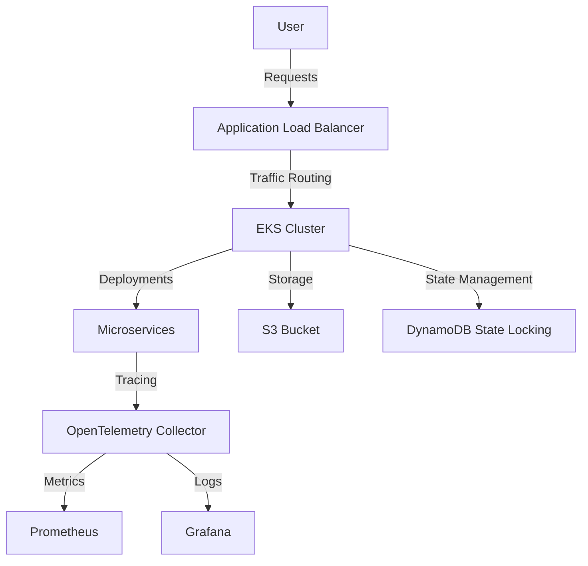

# 🚀 EcomTelemetry Terraform Infrastructure


This repository provides the **Terraform infrastructure setup** for **EcomTelemetry**, an end-to-end **OpenTelemetry demo eCommerce application** ([official demo](https://opentelemetry.io/docs/demo/)). It provisions a scalable, observable cloud environment on **AWS** using **EKS (Kubernetes), VPC, S3, and DynamoDB** for state management.

---

## 📌 Features
✅ **Modular Terraform Design** – Reusable modules for **EKS** and **VPC**  
✅ **State Management** – Backend configured with **S3** and **DynamoDB** for locking  
✅ **Highly Scalable** – Kubernetes-based deployment using **EKS**  
✅ **Observability** – Designed for **OpenTelemetry tracing & monitoring**  
✅ **Best Practices** – Follows **IaC principles**, ensuring **reproducibility** and **automation**  

---

## 🏗️ Infrastructure Architecture



---

## 📂 Terraform Module Structure
```
Terraform-aws-eks/
│── modules/
│   ├── eks/              # EKS Module
│   ├── vpc/              # VPC Module
│── backend/              # Statefile Management
│── main.tf               # Main entry Terraform file
│── variables.tf          # Input variables
│── outputs.tf            # Output values
│── .gitignore            # Ignore terraform state files
│── README.md             # Project Documentation
```

---

## ⚙️ Getting Started
### **1️⃣ Clone the Repository**
```bash
git clone https://github.com/Preetbandgar/Terraform-aws-eks.git
cd Terraform-aws-eks
```

### **2️⃣ Initialize Terraform**
```bash
terraform init
```

### **3️⃣ Plan and Apply Configuration**
```bash
terraform plan -out=tfplan
terraform apply tfplan
```

### **4️⃣ Destroy Infrastructure (if needed)**
```bash
terraform destroy
```

---

## 🏗️ Terraform Backend Configuration (S3 & DynamoDB)
This setup ensures **state management** and **locking** using an **S3 bucket** and **DynamoDB**.

```hcl
terraform {
  backend "s3" {
    bucket         = "ecomtelemetry-terraform-state"
    key            = "terraform/eks/terraform.tfstate"
    region         = "us-east-1"
    dynamodb_table = "terraform-state-lock"
    encrypt        = true
  }
}
```

---

## 🌐 EKS Module Configuration
```hcl
module "eks" {
  source          = "./modules/eks"
  cluster_name    = "ecomtelemetry-cluster"
  cluster_version = "1.27"
  node_group_size = "3"
}
```

---

## 🏗️ VPC Module Configuration
```hcl
module "vpc" {
  source       = "./modules/vpc"
  vpc_cidr     = "10.0.0.0/16"
  public_subnets  = ["10.0.1.0/24", "10.0.2.0/24"]
  private_subnets = ["10.0.3.0/24", "10.0.4.0/24"]
  enable_nat_gateway = true
}
```

---

## 📊 OpenTelemetry Integration
- **Traces:** Exported to **Jaeger/Zipkin**
- **Metrics:** Collected with **Prometheus**
- **Logs:** Visualized in **Grafana**

### **Example OpenTelemetry Collector Config (otel-collector-config.yaml)**
```yaml
receivers:
  otlp:
    protocols:
      grpc:
      http:
exporters:
  logging:
  prometheus:
    endpoint: ":9090"
service:
  pipelines:
    traces:
      receivers: [otlp]
      exporters: [logging]
    metrics:
      receivers: [otlp]
      exporters: [prometheus]
```

---

## 🎯 Roadmap & Future Enhancements
- [ ] **Autoscaling** for EKS Nodes
- [ ] **Service Mesh (Istio/Linkerd)** for traffic management
- [ ] **CI/CD Integration** (GitHub Actions/Terraform Cloud)

---

## 💬 Contributing
Contributions are welcome! Feel free to fork the repo and submit PRs. 🚀

---

## 📜 License
This project is **open-source** and licensed under **MIT License**.

---

## 📞 Contact
- **GitHub**: [Preetbandgar](https://github.com/Preetbandgar)
- **Email**: bandgar.pritam8@gmail.com

---

### 🌟 If you like this project, consider giving it a ⭐ on GitHub!
